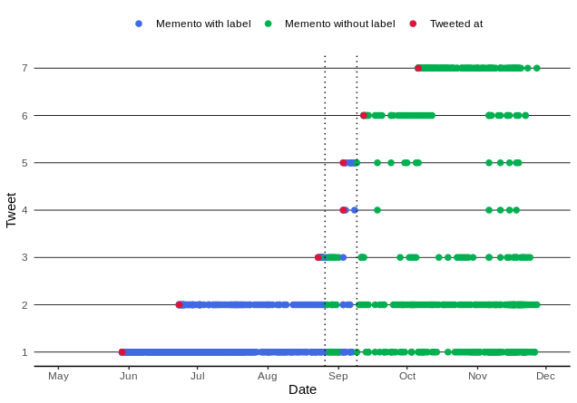

# Challenges In Replaying Archived Twitter Pages

## Twitter labels
Analyzing President Trump’s tweets labeled by Twitter in Internet archive (IA). 


*Visualizing the old UI mementos with and without label for Trump’s first seven tweets which were labeled for violating Twitter rules. Before August 26, 2020 (dotted line 1), we would see the mementos do not have labels (blue dot) and after September 9, 2020  (dotted line 2), we would see the labels in the mementos (green dot). The red dot shows when each tweet was created. New UI mementos are not represented in this chart.*

#### Dataset
1. **realDonaldTrump_LabeledTweets.tsv**: Labelled tweets/retweets by @realDonaldTrump from May 25, 2020, through Nov 25, 2020 (six months). 
* Date 
* What's labeled? T/RT
  * T - Tweet authored by Donald Trump is labeled.
  * RT - Original tweet that was retweeted/ quote tweeted by Donald Trump is labeled.
  * T&RT - Both the original tweet that was quote tweeted by Donald Trump and his quote tweet are labeled. 
* Tweet_ID 
* Type  
  * F - Fact checked
  * V - Twitter rules violated
  * F&V - Has both 
  * RT - Trump's tweet is not labeled, but the original tweet that he retweeted is labeled 
* Our Categorization: F(1) V(0)
  * 1 - Fact-check label
  * 0 - "Violated Twitter Rules" label
2. **voilationlabels_trump_2020-11-10.csv**: Tweets labeled for violating Twitter rules. 
3. **Extract_labels_mementos**: Contain data files and code to extract labels from old UI mementos in IA (used to plot the above visualization).


## Temporal delta 
Analyzing new Twitter UI mementos for temporal violations.

#### Dataset
1. **replaydeltaofall5sections.tsv**: Delta between the datetime of the Twitter memento and the datetime of all five embedded sections (tweets, bio, media, “You might like”, and “What’s happening”). 
2. **offbytweets_inNewUI.tsv**: New UI account page Twitter mementos with the missing number of tweets. 

## Citing Project

A publication related to this project appeared in the proceedings of JCDL 2021 ([Read the PDF](https://arxiv.org/pdf/2108.12092.pdf)). This work is also published in the International Journal on Digital Libraries special issue ([PDF](https://doi.org/10.1007/s00799-023-00379-w)). Please cite it below:

```bib
@inproceedings{JCDL@Garg2021Twitter,
 author    = {Garg, Kritika and Jayanetti, Himarsha R. and Alam, Sawood and Weigle, Michele C. and Nelson, Michael L.},
 title     = {Replaying Archived Twitter: When your bird is broken, will it bring you down?},
 booktitle = {Proceedings of the 2021 ACM/IEEE Joint Conference on Digital Libraries (JCDL)},
 year      = {2021},
 pages     = {160-169},
 doi       = {10.1109/JCDL52503.2021.00028},
 url       = {http://dx.doi.org/10.1109/JCDL52503.2021.00028},
 month     = {sep}
}
```
